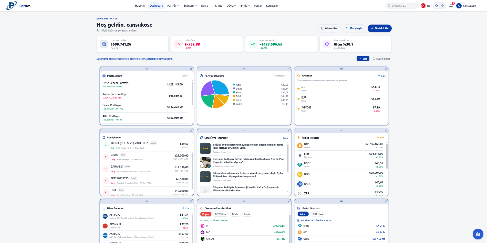
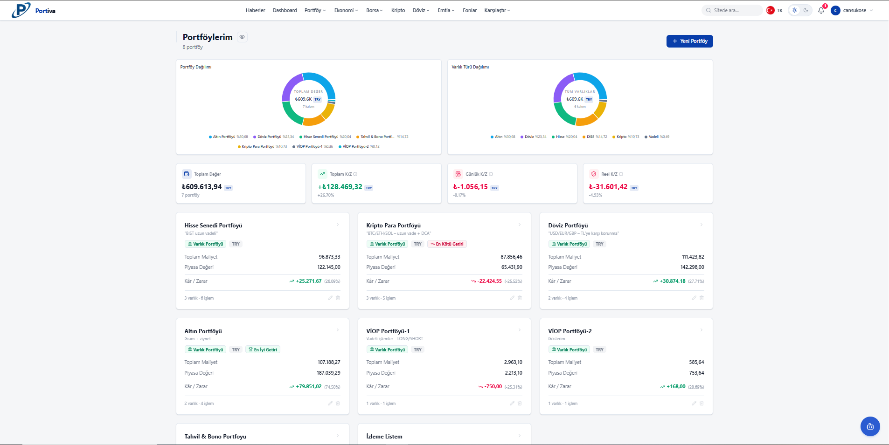
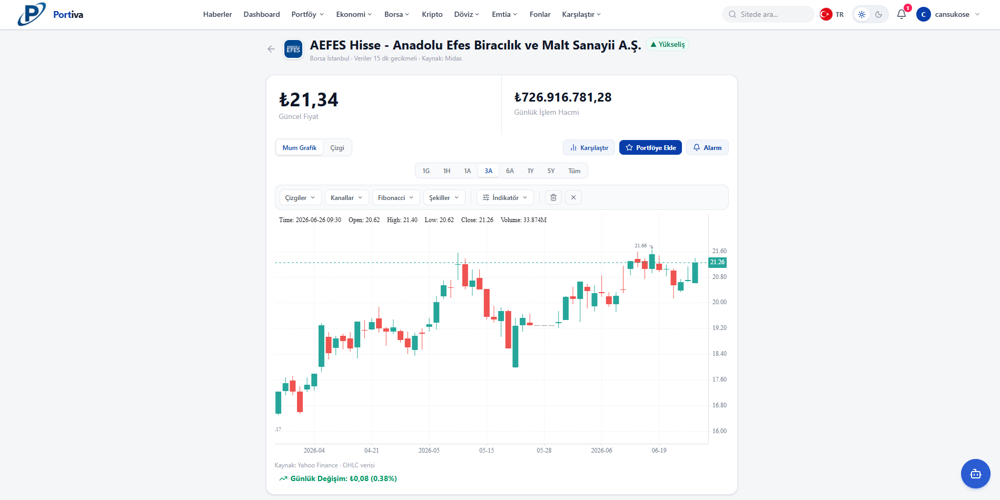
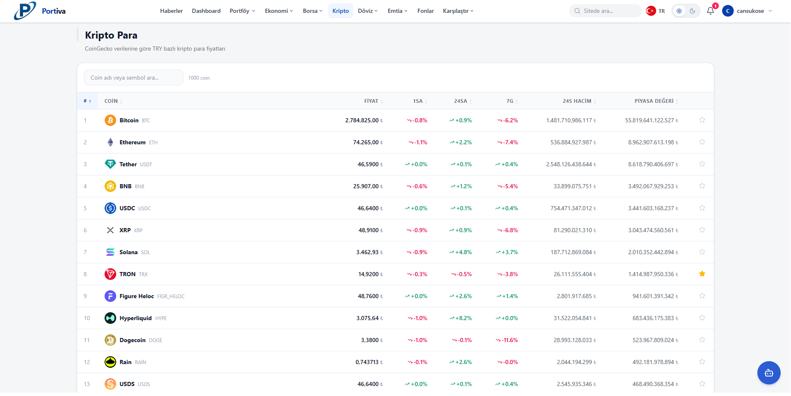
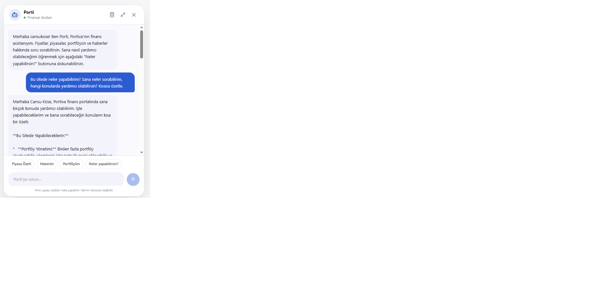
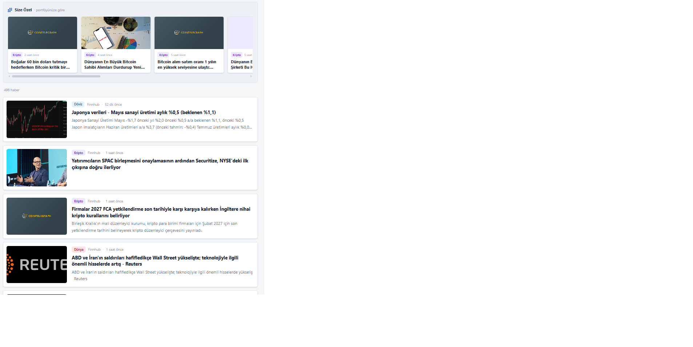

# Finance Portal

**Toyota 32Bit · Multi-asset portfolio tracking and market monitoring platform**

**English** · [Türkçe](README.tr.md) &nbsp;·&nbsp; [](LICENSE)

<br clear="left"/>

<p align="center">
  
  
  
  
  
  
  <br/>
  
  
  
  
  
</p>

---

> **Finance Portal** is a multi-asset **portfolio tracking and market monitoring** platform focused on Turkish financial markets. It brings stocks, cryptocurrencies, foreign exchange, mutual funds, government/corporate bonds, Eurobonds, VIOP (futures), commodities, precious metals, stock indices, economic indicators and financial news together in a single interface; on top of this it adds portfolio tracking, price alerts, technical analysis, an AI chat assistant and a personalized news feed.

## About the Project

The system consists of three main layers:

- **Backend** — Java 21 + Spring Boot 3.2.1. Modular monolith + layered (Controller/Service/Repository) + Clean Architecture; 12 functional domains, a REST API, multiple external data integrations and resilience patterns. → [Backend README](backend/finance-portal-backend/README.md)
- **Frontend** — React 19 + Vite single-page application (SPA). Keycloak OIDC, TR/EN i18n, light/dark theme, financial charts and a customizable dashboard. → [Frontend README](frontend/finance-portal-frontend/README.md)
- **Infrastructure** — Full stack via Docker Compose: identity (Keycloak + LDAP), messaging (Kafka), observability (OpenSearch, Prometheus + Grafana, Tempo + OpenTelemetry). Ships with Kubernetes (GKE) manifests and a GitHub Actions CI/CD pipeline.

> For technology details see [Technology Stack](#technology-stack); for architecture see [System Architecture](#system-architecture).

## Table of Contents

1. [Features](#features)
2. [Module Showcase](#module-showcase)
3. [System Architecture](#system-architecture)
4. [Installation & Running](#installation--running)
5. [Technology Stack](#technology-stack)
6. [Directory & Code Structure](#directory--code-structure)
7. [Services & Access Details](#services--access-details)
8. [Server Side (Backend)](#server-side-backend)
9. [Client Side (Frontend)](#client-side-frontend)
10. [Monitoring & Observability](#monitoring--observability)
11. [Security Architecture](#security-architecture)
12. [Continuous Integration & Deployment](#continuous-integration--deployment)
13. [Testing & Code Quality](#testing--code-quality)
14. [Things to Note](#things-to-note)
15. [Troubleshooting](#troubleshooting)
16. [Detailed Documentation](#detailed-documentation)
17. [Contact](#contact)
18. [License](#license)

## Features

| Area | Description |
|---|---|
| **Stocks / Indices** | BIST stocks and stock indices — live price, history, candlestick (OHLC) charts; 40+ index list/detail, comparison. |
| **Cryptocurrencies** | Crypto price, candlestick chart, Fear & Greed index; uninterrupted data via a multi-source chain (Binance → Yahoo → CoinGecko). |
| **Foreign Exchange (FX)** | TCMB and bank rates; rate table, currency converter, comparison, historical chart. |
| **Mutual Funds** | TEFAS funds (~1000+) — type/company/returns (1m/3m/6m/1y/3y/5y), detail, comparison. |
| **Government / Corporate Bonds** | TCMB EVDS DİBS (with TCMB classification) + Eurobonds (HMB ISIN + Business Insider charts). |
| **VIOP (Futures)** | İş Yatırım / Akbank contracts; long/short position tracking, margin, automatic settlement at maturity. |
| **Commodities / Precious Metals** | Gold, silver, platinum, palladium, commodities — price, history, comparison. |
| **Economy / Inflation** | TCMB EVDS (CPI, rates, macro) + FRED (US CPI); economic calendar (TradingView, keyless), loan/deposit calculators. |
| **Portfolio Tracking** | Multi-asset portfolio; average cost, current value, P/L, asset allocation, performance, "what-if" analysis, AI analysis, Excel/PDF export. |
| **Watchlist** | Multiple watchlists, quick add via star. |
| **Price Alerts** | Price / change / volume alerts; in-app notification + email (TR/EN). |
| **News** | Multi-source RSS news feed, classification, personalized "For You" news. |
| **AI Chat Assistant** | Multi-provider (Groq/Gemini) + tool calling: price, history, news, portfolio summary, economic indicator, scenario simulation, alarm creation, add to watchlist. |
| **Technical Analysis** | Moving averages (MA), RSI, MACD, Bollinger; drawing and saving on charts. |
| **Notifications** | In-app notification center + bell badge. |
| **Newsletter** | Daily / weekly / monthly portfolio + market summary email. |
| **Support Tickets** | User support ticket creation; admin status management. |
| **Administration (Admin)** | User management (Keycloak), ban (cascade), Eurobond ISIN / cache management. |
| **Identity** | Keycloak OIDC + TOTP 2FA + LDAP federation + email verification. |
| **Cross-Device Sync** | User preferences (dashboard layout, theme, language, chart drawings) are stored on the server and carried across devices. |

## Module Showcase

A visual tour of the core modules — each tile maps a requirement (news, market data, historical analysis, portfolio) to the screen that fulfills it, plus the extras that go beyond the spec (AI assistant, what-if analysis).

<table>
  <tr>
    <td width="50%" valign="top">
      
      <p><b>Customizable Dashboard</b><br/>
      Drag-and-drop grid of market cards, watchlists and a TRY-normalized allocation pie. Layout is saved per user and synced across devices.</p>
    </td>
    <td width="50%" valign="top">
      
      <p><b>Portfolio &amp; AI Analysis</b><br/>
      Multi-asset tracking — average cost, current value, P/L (₺ / %), allocation pie and performance — plus an AI-powered "Analyze" view with risk scoring and what-if scenarios.</p>
    </td>
  </tr>
  <tr>
    <td width="50%" valign="top">
      
      <p><b>Charts &amp; Technical Analysis</b><br/>
      Interactive candlestick (OHLC) charts with moving averages, RSI, MACD and Bollinger bands; date-range selection, multi-instrument comparison and trend signals.</p>
    </td>
    <td width="50%" valign="top">
      
      <p><b>Markets — Stocks · Bonds · FX · Funds · VIOP · Crypto</b><br/>
      Live prices and detail pages for every instrument class: BIST stocks &amp; indices, TCMB/Eurobond bonds, FX, TEFAS funds, futures and crypto.</p>
    </td>
  </tr>
  <tr>
    <td width="50%" valign="top">
      
      <p><b>AI Chat Assistant (Porti)</b><br/>
      Multi-provider (Groq / Gemini) assistant with tool calling: live price, history, news, portfolio summary, economic indicators, scenario simulation and alarm creation.</p>
    </td>
    <td width="50%" valign="top">
      
      <p><b>News &amp; Personalized Feed</b><br/>
      Multi-source RSS aggregated news with category filtering and a portfolio-based "For You" feed that surfaces what matters to your holdings.</p>
    </td>
  </tr>
</table>

> Screenshots are illustrative; the live UI supports light/dark themes and TR/EN.

## System Architecture

The system is designed as a **modular monolith**: a single deployable backend application containing 12 domains cleanly separated by functional area (each layered with Clean Architecture). All components run as **containers**; they are orchestrated with **Docker Compose** in development and **Kubernetes (GKE)** in production. External access comes through a single entry point (reverse proxy / Ingress); the backend connects to external data sources via a port/adapter abstraction.


> Groups (Client / Core Application / Security / Observability) are a **logical grouping**; in docker-compose all services run on a single network.

**Main components:**

- **Web Frontend (React + Nginx)** — User interface; routes `/api` requests to the backend and serves all other paths to the SPA.
- **Backend API (Spring Boot)** — Business logic, external data integration, caching and the REST API. Validates JWTs locally against the Keycloak JWKS.
- **Keycloak + LDAP** — Authentication, authorization, 2FA; LDAP federation.
- **PostgreSQL** — User-owned persistent data (portfolio, alarms, notifications, etc.).
- **Redis** — Cache and distributed lock (ShedLock).
- **Kafka** — Asynchronous log pipeline (backend logs are transported without blocking the main business flow).
- **Log Consumer** — A **separate Java service, independent of the backend**: it listens to the Kafka log topic and writes (indexes) incoming JSON log records to OpenSearch. This decouples logging from application logic.
- **OpenSearch** — Where logs are stored and searched (queried via OpenSearch Dashboards).
- **OpenTelemetry → Tempo / Prometheus → Grafana** — Distributed tracing, metrics and dashboards.

> For detailed architecture (C4 model, component diagrams, interaction scenarios) see the [Technical Design Document](#detailed-documentation).

## Installation & Running

This section contains **all the steps** needed for **someone with no prior knowledge** to run the project from scratch. The system comes up with a single command (`docker compose up -d`); you do **not** need to fill in any API keys (it runs without them).

### 1. Requirements

You only need the following installed on your machine:

- **[Docker Desktop](https://www.docker.com/products/docker-desktop/)** (includes Docker Compose v2) — **8 GB+ RAM** recommended (~15 services run simultaneously).
- **Git** (to clone the repository).

> You do **not** need to install Java, Node.js or anything else — everything runs inside Docker containers. (Only for non-Docker local development do you need JDK 21 + Node.js 20.)

### 2. Setup (in 3 steps)

```bash
# 1) Clone the repository and enter the directory
git clone https://github.com/BerkanGulyagci/finance-portal.git
cd finance-portal

# 2) Create the environment file from the example (REQUIRED step — may be left empty)
cp backend/finance-portal-backend/.env.local.example backend/finance-portal-backend/.env.local

# 3) Bring up the whole system with a single command
docker compose up -d
```

> ⚠️ **Step 2 is mandatory.** Without the `.env.local` file, `docker compose up` fails. Copying the example file is enough — even if you **don't fill in** the keys, the system still works (only the related external data sources / AI / email features stay disabled, everything else works).

On the first start, Docker images are built and Keycloak / LDAP / OpenSearch are initialized — this may take **a few minutes**. To watch progress:

```bash
docker compose ps                 # service status (all should be "running"/"healthy")
docker compose logs -f backend    # follow backend logs
```

### 3. Verifying It Works

Once the system is ready, open the following in your browser:

| Address | What you should see |
|---|---|
| **http://localhost:5173** | Finance Portal home page (news, market cards) |
| **http://localhost:8080/swagger-ui.html** | Backend API documentation (Swagger) |
| **http://localhost:8080/actuator/health** | `{"status":"UP"}` response |

If the home page opens, the setup is successful. To sign in, create an account via **Register** at the top right (email verification + 2FA setup is requested on first login). Market and news pages can also be viewed **without signing in**.

### 4. Stopping the System

```bash
docker compose down          # stop services (data is preserved)
docker compose down -v       # stop services + delete all data (to start fresh)
```

### Environment Variables (Optional — For Full Features)

The system runs without keys; however, to enable certain external data sources and features, API keys can be added to the `.env.local` file. **Most keys are free** and obtained from the addresses below:

| Variable | Service | Purpose | Where to get the key |
|---|---|---|---|
| `EVDS_API_KEY` | TCMB EVDS | Bonds, inflation, deposits | [evds2.tcmb.gov.tr](https://evds2.tcmb.gov.tr) (free, registration) |
| `FRED_API_KEY` | FRED | US inflation (CPI) | [fred.stlouisfed.org/docs/api](https://fred.stlouisfed.org/docs/api/api_key.html) (free) |
| `ASSISTANT_API_KEY` | Groq | AI chat assistant | [console.groq.com/keys](https://console.groq.com/keys) (free) |
| `GEMINI_API_KEY` | Gemini | AI (fallback) | [aistudio.google.com/apikey](https://aistudio.google.com/apikey) (free) |
| `COINGECKO_API_KEY` | CoinGecko | Crypto market data | [coingecko.com/api](https://www.coingecko.com/en/api) (works without a key too) |
| `TEFAS_BEARER_TOKEN` | TEFAS | Mutual funds | (an anonymous default exists) |
| `KEYCLOAK_ADMIN_CLIENT_SECRET` | Keycloak | Admin user management | Keycloak console → Clients → `finance-portal-admin-service` → Credentials |
| `SMTP_*` | Email | Alarm / newsletter emails | Gmail App Password (to send email) |

> All variables and their descriptions are in `.env.local.example`. **The system comes up even if you fill in none of them** — only the related features stay disabled. In production these values are managed via Kubernetes Secrets.

## Technology Stack

| Layer | Technologies |
|---|---|
| **Backend** | Java 21, Spring Boot 3.2.1 (Web, Security / OAuth2 Resource Server, Data JPA, Data Redis, Kafka, Mail, Cache, Validation, Actuator), Lombok |
| **Data** | PostgreSQL 17, Redis 7, Flyway (migration), Hibernate / JPA |
| **Resilience / Scheduling** | Resilience4j (retry / circuit breaker), ShedLock (distributed lock), Last Known Good (LKG) cache |
| **Frontend** | React 19, Vite, React Router 7, Tailwind CSS, Axios; klinecharts, ECharts, Recharts; react-grid-layout; html-to-image, jsPDF, xlsx |
| **Identity** | Keycloak 26, LDAP (ApacheDS), JWT / OAuth2 / OIDC, TOTP 2FA |
| **Messaging** | Apache Kafka |
| **Observability** | OpenTelemetry, Prometheus, Tempo, OpenSearch + Dashboards, Grafana, log4j2 (JSON) |
| **API Documentation** | springdoc-openapi (Swagger UI) |
| **Deployment** | Docker, Docker Compose, Kubernetes (GKE), GitHub Actions (CI/CD) |
| **Testing / Quality** | JUnit 5, Testcontainers, WireMock, Vitest, React Testing Library, JaCoCo, SonarQube, k6 (load testing) |

## Directory & Code Structure

```
32bit-finance-portal-backend/
├── backend/finance-portal-backend/    # Spring Boot (Java 21) — REST API, schedulers, fetchers
│   └── src/main/java/com/finance/portal/
│       ├── market/        # Market data (stocks, crypto, FX, funds, bonds, VIOP, commodities, indices, economy)
│       ├── portfolio/     # Portfolio, transactions, watchlist, valuation, what-if, AI analysis
│       ├── alarm/         # Price / change / volume alerts
│       ├── notification/  # In-app notification + email
│       ├── news/          # Multi-source news aggregation + personalization
│       ├── assistant/     # AI chat assistant (tool-calling)
│       ├── newsletter/    # Newsletter subscription + digest
│       ├── support/       # Support tickets
│       ├── preferences/   # User preferences (cross-device sync)
│       ├── admin/         # User management, ban (Keycloak)
│       ├── auth/          # Authentication helpers, registration
│       └── common/        # Cross-cutting: security, logging, caching, errors, config
│   └── src/main/resources/{application*.yml, db/migration/ (17 scripts), log4j2-*}
│
├── frontend/finance-portal-frontend/  # React 19 + Vite SPA
│   └── src/{features, app, components, context, api, router, hooks, i18n, lib, utils}
│
├── log-consumer/          # Kafka → OpenSearch log indexer (separate Java service)
├── docker/                # apacheds, grafana, keycloak, ldap, otel, postgres, prometheus, tempo config
├── k8s/                   # Kubernetes / GKE manifests (00-base, 01-data, 02-app, 03-monitoring) + WIF setup
├── perf-tests/            # k6 load tests
├── .github/workflows/     # CI (ci.yml) + CD (cd.yml)
├── docker-compose.yml     # Full-stack orchestration
├── assets/                # README images (logo, architecture)
└── README.md
```

## Services & Access Details

After the stack is started, it is accessible at the following addresses.

| Service | URL | Default Credentials (development) |
|---|---|---|
| **Web Interface (Frontend)** | http://localhost:5173 | — |
| **Backend API** | http://localhost:8080 | (JWT) |
| **Swagger UI** | http://localhost:8080/swagger-ui.html | — |
| **Backend Health** | http://localhost:8080/actuator/health | — |
| **Keycloak** | http://localhost:8081 | `admin` / `admin` |
| **Grafana** | http://localhost:3000 | `admin` / `admin` |
| **Prometheus** | http://localhost:9090 | — |
| **OpenSearch Dashboards** | http://localhost:5601 | — |
| **Tempo** | http://localhost:3200 | — |
| **PostgreSQL** | localhost:5433 | (development credentials — in `.env`) |
| **Redis** | localhost:6379 | — |
| **Kafka** | localhost:9092 | — |
| **OpenSearch (REST)** | localhost:9200 | — |
| **LDAP (ApacheDS)** | localhost:10389 | — |
| **SonarQube** (only `sonar` profile) | http://localhost:9000 | `admin` / `admin` |

> ⚠️ These credentials are for **development only**; they must be changed in production and managed via Kubernetes Secrets.

**First login:** Self-registration is open in Keycloak — you can create an account via **Register** at `http://localhost:5173`, or define a user in the `finance-portal` realm from the Keycloak admin console (`http://localhost:8081`). Email verification and TOTP 2FA setup are required on first login.

## Server Side (Backend)

The backend is a **modular monolith** built on Spring Boot 3.2.1 (Java 21). All endpoints live under `/api/v1/**`.

- **36 REST controllers, 124 endpoints** — spread across 12 functional domains.
- **Access levels:** Public (incl. guests — market, news), Authenticated (portfolio, alarms, notifications), Admin (user management).
- **Standard response:** All responses are wrapped in `ApiResponse<T>` (success, message, data, timestamp).
- **31 scheduled tasks (across 22 classes)** — alarm evaluation (60 s), market / fund / bond cache warm-up, maturity settlement, newsletter digest (distributed-locked with ShedLock).
- **Resilience:** Last Known Good (LKG) pattern + Resilience4j (retry / circuit breaker) + 50+ Redis cache namespaces.

**Main endpoint groups:**

| Group | Base Path | Access |
|---|---|---|
| Market (stocks, crypto, FX, funds, bonds, VIOP, commodities, indices, economy) | `/api/v1/market/**`, `/api/v1/commodities`, `/api/v1/gold` | Public |
| News | `/api/v1/news/**` | Public |
| Portfolio, transactions, watchlist, analysis | `/api/v1/portfolios/**` | Authenticated |
| Alarms | `/api/v1/alarms/**` | Authenticated |
| Notifications | `/api/v1/notifications/**` | Authenticated |
| User info and preferences | `/api/v1/me/**` | Authenticated |
| Support tickets | `/api/v1/support/**` | Authenticated |
| Newsletter | `/api/v1/newsletter/**` | Authenticated |
| Chat assistant | `/api/v1/assistant/**` | Public (limited) |
| Administration | `/api/v1/admin/**` | Admin |

> For the full endpoint list, see **Swagger UI** (`/swagger-ui.html`) on the running system, and for detailed backend documentation see [`backend/finance-portal-backend/README.md`](backend/finance-portal-backend/README.md).

### Endpoint Catalog (Examples)

Endpoints of selected prominent domains are listed below. For the full list, use Swagger UI (`/swagger-ui.html`).

**Portfolio (`/api/v1/portfolios`)** — Authentication required

| Method | Path | Description |
|---|---|---|
| GET | `/` | List the user's portfolios |
| POST | `/` | Create a new portfolio |
| GET | `/{id}` | Portfolio detail (holdings + valuation) |
| GET | `/{id}/performance` | Performance (time series) |
| GET | `/{id}/what-if` | "What if?" opportunity-cost analysis |
| GET | `/{id}/ai-analysis` | AI portfolio analysis |
| GET | `/{id}/rebalance` | Rebalancing suggestion |
| POST | `/{id}/transactions` | Add a transaction (buy / sell record) |
| DELETE | `/{id}/transactions/{txId}` | Delete a transaction |
| GET / POST / DELETE | `/{id}/watchlist[...]` | Watchlist management |

**Alarms (`/api/v1/alarms`)** — Authentication required

| Method | Path | Description |
|---|---|---|
| GET | `/` | List alarms |
| POST | `/` | Create an alarm (price / change / volume) |
| GET | `/{id}` | Alarm detail |
| DELETE | `/{id}` | Delete an alarm |

**Market — Stocks (`/api/v1/market/stocks`)** — Public

| Method | Path | Description |
|---|---|---|
| GET | `/` | Stock list (paginated) |
| GET | `/{symbol}` | Stock detail |
| GET | `/{symbol}/chart` | Chart data |
| GET | `/{symbol}/ohlc` | Candlestick (OHLC) data |

> A similar pattern repeats across all asset types (crypto, FX, funds, bonds, VIOP, commodities, indices). All responses are wrapped in `ApiResponse<T>`.

### Scheduled Tasks (Schedulers)

The system uses **31 scheduled tasks (across 22 classes)** to refresh external data and run periodic jobs. In a multi-replica environment, the ones marked 🔒 run on a single replica only via ShedLock.

| Task | Schedule | Function |
|---|---|---|
| Alarm evaluation | 60 seconds | Check active alarms against current prices, notify triggered ones |
| Market movers warm-up | ~90 seconds | Refresh the movers cache |
| Fund list warm-up | ~8 minutes | Refresh the TEFAS fund cache |
| Bond / FX / economy warm-up | 2–4 hours | Refresh the EVDS / FRED caches |
| TCMB DİBS classification | Daily 06:20 | Update bond categories from TCMB |
| Eurobond ISIN refresh | 21st of the month 06:00 | Update the HMB ISIN list |
| Newsletter digest 🔒 | Daily 08:00 | Daily / weekly / monthly summary email |
| VIOP / bond / Eurobond maturity settlement 🔒 | Daily 00:30–00:35 | Automatically close matured positions |
| Temporary ban expiry 🔒 | Periodic | Automatically lift expired bans |

## Client Side (Frontend)

A React 19 + Vite single-page application (SPA). All data comes from the backend via `/api/v1/*`.

- **9 feature areas, 47 pages** — dashboard, market (10 asset types), portfolio, alarms, news, notifications, profile, admin, auth.
- **3 access tiers:** Public (guest), Protected (registered user), Admin — via `ProtectedRoute` / `AdminRoute`.
- **State management:** 7 React Contexts (identity, theme, language, preferences, watchlist, notifications, confirmation) — no Redux.
- **Charts:** klinecharts (detail candlesticks + indicators + drawing), ECharts (comparison), Recharts (analysis / allocation).
- **Identity:** Keycloak OIDC (PKCE / S256), proactive + single-flight token refresh.
- **Theme & language:** Light / dark theme (CSS variables, FOUC prevention), TR / EN i18n (14 namespaces), multi-currency display.
- **Export:** Excel (xlsx), PDF (jsPDF), chart image (PNG).

> For detailed frontend documentation see [`frontend/finance-portal-frontend/README.md`](frontend/finance-portal-frontend/README.md).

## Monitoring & Observability

For end-to-end observability in production, the system collects **three pillars** (metrics, traces, logs) and unifies them around OpenTelemetry.

| Pillar | Flow | Store | Visualization |
|---|---|---|---|
| **Metrics** | Micrometer → OTel Collector / Actuator | Prometheus | Grafana |
| **Traces** | OTel Java Agent → OTel Collector | Tempo | Grafana |
| **Logs** | log4j2 (JSON) → Kafka → Log Consumer | OpenSearch | OpenSearch Dashboards / Grafana |

**Grafana dashboards (4 ready-made)** — Loaded **automatically** at startup (provisioning), no extra steps needed:

- **APM Dashboard** — request volume, response time, error rate, p95 latency, JVM/GC, CPU, HikariCP, circuit breaker state, cache hit ratio.
- **External Data Sources Dashboard** — request/error/latency per external source; **silent failure** detection (PARSE/EMPTY/RATE_LIMITED) and **ban risk (403/429)** monitoring for scrape sources. Designed to manage the risk arising from the system's dependency on 20+ external sources.
- **Logs Dashboard** — level / status / category distribution, top requested endpoints, error rate.
- **Notifications & Alarms Dashboard** — triggered alarms, sent / failed emails, newsletter subscriptions, notifications.

In addition, critical user/admin actions flow to OpenSearch as **AUDIT logs** (`CentralBusinessLogService`) and external service calls as **integration logs** (`CentralIntegrationLogService`), in structured (JSON) form.

> Trace ↔ log correlation: in Grafana, you can jump directly from a trace span to that request's OpenSearch logs.

> **Note:** The ready-made log dashboards are in **Grafana** (the "Logs Dashboard" above) and come up automatically. **OpenSearch Dashboards** (`http://localhost:5601`) is used for free-form search/querying (ad-hoc exploration) over raw logs; no dashboard import is required.

## Security Architecture

- **Identity:** Keycloak 26 (realm `finance-portal`) + LDAP (ApacheDS) federation. OAuth2 / OIDC, JWT (RS256).
- **Two-factor authentication:** TOTP-based 2FA (Google Authenticator / FreeOTP) and email verification.
- **Authorization (RBAC):** Two roles — `USER` (personal resources) and `ADMIN` (administration). All access rules are centralized in `SecurityConfig`; in addition, **resource ownership** is verified (a user can access only their own data).
- **Login flow:** Authorization Code + PKCE (S256). The backend validates JWTs **locally** against the Keycloak JWKS (without calling Keycloak on every request).
- **Transport security:** HTTPS/TLS in production (GKE ManagedCertificate — automatic Let's Encrypt).
- **Other measures:** CORS configuration, input validation (Bean Validation), log sanitization (CRLF / log injection prevention), rate limiting for anonymous users (safe IP via X-Forwarded-For), stateless sessions (no CSRF attack surface), secret management (`.env.local` / Kubernetes Secret, fail-loud).
- **Ban mechanism:** An admin ban triggers a cascade affecting multiple modules in one action (Keycloak account disabled + alarms / newsletter disabled + notification); timed bans are automatically reverted.

> The security design references the STRIDE threat model and OWASP ASVS. For details, see the Security section of the [Technical Design Document](#detailed-documentation).

## Continuous Integration & Deployment

The project is automated with a GitHub Actions-based CI/CD pipeline.

| Pipeline | Trigger | Function |
|---|---|---|
| **CI** (`ci.yml`) | push to `main` + pull request | Backend `mvn verify` (build + tests + JaCoCo) and frontend Vitest. Blocks the change if it fails. |
| **CD** (`cd.yml`) | Manual (`workflow_dispatch`) | Build images + push to Artifact Registry (git-SHA tagged), then deploy to GKE with manual approval. |

**Deployment paths:**

| Path | Command | Description |
|---|---|---|
| **Docker Compose** (development) | `docker compose up -d` | Full stack on a single host (14 services; +SonarQube under the `sonar` profile) |
| **Kubernetes (GKE)** | `kubectl apply -k k8s/...` | Layered manifests (00-base → 01-data → 02-app → 03-monitoring); HPA (2–6 replicas), PDB, ManagedCertificate TLS |
| **CI/CD** | GitHub Actions | CI on every push; CD to GKE via manual trigger |

**Keyless cloud access:** The CD pipeline uses **Workload Identity Federation (WIF)** instead of a long-lived service account key — authentication with short-lived OIDC tokens (no secret-leak risk).

> The production environment runs on GKE in the `portiva` namespace; all external access is served over TLS through a single Ingress.

## Testing & Code Quality

The system is verified with a multi-level test strategy aligned with the test pyramid. The codebase contains **over 5,000 tests** (approximately 2,700 backend + 2,500 frontend).

| Test Type | Tool | Scope |
|---|---|---|
| **Unit** | JUnit 5 (backend), Vitest (frontend) | Single class / function logic |
| **Integration** | Spring Boot Test + Testcontainers | Flows running against real PostgreSQL / Redis |
| **API (Controller)** | Spring MockMvc | REST endpoint behavior |
| **Security** | spring-security-test | Authentication / authorization |
| **Component** | React Testing Library + jsdom | Frontend components |
| **Smoke** | JUnit 5 | Quick validation of basic building blocks (POJO/DTO) |
| **External Service Mock** | WireMock | Mocking external APIs |
| **Performance / Load** | k6 | Response time under load (`perf-tests/`) |

```bash
# Backend tests + JaCoCo coverage report
cd backend/finance-portal-backend && ./mvnw verify
# Report: target/site/jacoco/index.html

# Frontend tests
cd frontend/finance-portal-frontend && npm run test

# Load test (k6 must be installed, backend running)
k6 run perf-tests/load-test-safe.js
```

**Code quality:** JaCoCo (coverage, reported in CI) + **SonarQube** (static analysis / quality gate, self-hosted via the `sonar` profile, run manually).

## Things to Note

- **It is a portfolio tracking system** — it does not send real buy/sell orders; it records the user's assets and transactions and provides valuation / analysis. It is not investment advice.
- **External source resilience** — the system depends on 20+ external sources; even if one fails, the last valid data is served via Last Known Good (LKG), so the system does not go down. Sources without an API key work anonymously / with limits.
- **`.env.local` is mandatory** — it must be copied from `.env.local.example` before `docker compose up` (it may be left empty). Startup fails without this file.
- **Ports** — Keycloak `8081` (so it doesn't clash with backend `8080`), PostgreSQL host port `5433`, backend `8080`, frontend `5173`.
- **SonarQube** is under a separate Compose profile (`sonar`); it does not start with a plain `docker compose up` (requires `docker compose --profile sonar up -d`).
- **Secrets** — real API keys / passwords live in `.env.local` (gitignored) and are not pushed to the repo. Kubernetes Secrets are used in production.
- **The production profile (`prod`)** halts startup if a critical secret is missing (fail-loud) — it does not silently run with a faulty configuration.

## Troubleshooting

```bash
# Service status + logs
docker compose ps
docker compose logs -f backend

# Backend health check
curl http://localhost:8080/actuator/health

# Test the PostgreSQL connection
docker compose exec postgres psql -U berkan -d finance_portal -c "SELECT 1;"

# Port conflict check (Windows)
netstat -ano | findstr :8080

# Completely clean start (DELETES ALL data)
docker compose down -v && docker compose up -d
```

| Symptom | Likely cause / fix |
|---|---|
| `docker compose up` errors out | `.env.local` not created → `cp .env.local.example .env.local` (setup step 2) |
| Bonds / inflation / deposits empty | `EVDS_API_KEY` missing → add it to `.env.local` |
| AI chat says "unavailable" | `ASSISTANT_API_KEY` / `GEMINI_API_KEY` missing → add it |
| Email not being sent | `SMTP_*` variables missing / incorrect |
| Backend slow to start | The first start may take a few minutes due to Spring Boot + OTel agent + Keycloak JWK fetch; the healthcheck has a startup tolerance |
| Page won't open / 502 | Backend not ready yet; wait for the "Started" message in `docker compose logs -f backend` |

## Detailed Documentation

This README provides an overview. Detailed documentation:

| Document | Content |
|---|---|
| **[Analysis Document (SRS)](docs/Finans_Portali_Analiz_Dokumani.pdf)** | Business/user requirements, functional (FR) and non-functional (NFR) requirements, data/interface requirements, acceptance criteria — *ISO/IEC/IEEE 29148, ISO/IEC 25010* |
| **[Technical Design Document (SDD)](docs/Finans_Portali_Teknik_Analiz_Dokumani.pdf)** | Architecture (C4), backend / frontend / data / API / security / deployment / observability design, architecture decisions (ADR), risks, verification — *IEEE 1016, ISO/IEC/IEEE 42010, OWASP ASVS* |
| **Backend README** | [`backend/finance-portal-backend/README.md`](backend/finance-portal-backend/README.md) — backend-specific technical details |
| **Frontend README** | [`frontend/finance-portal-frontend/README.md`](frontend/finance-portal-frontend/README.md) — frontend-specific technical details |
| **Swagger UI** | `http://localhost:8080/swagger-ui.html` — interactive API documentation (on the running system) |

## Contact

**Developer:** Berkan Gülyağcı
**Organization:** Toyota 32Bit
**Email:** bgulyaci@gmail.com
**GitHub:** [@BerkanGulyagci](https://github.com/BerkanGulyagci)

## License

This project is licensed under the **MIT License**. See the [LICENSE](LICENSE) file for details.

---

<div align="center">
<sub>Toyota 32Bit · Finance Portal — © 2026 Berkan Gülyağcı</sub>
</div>
