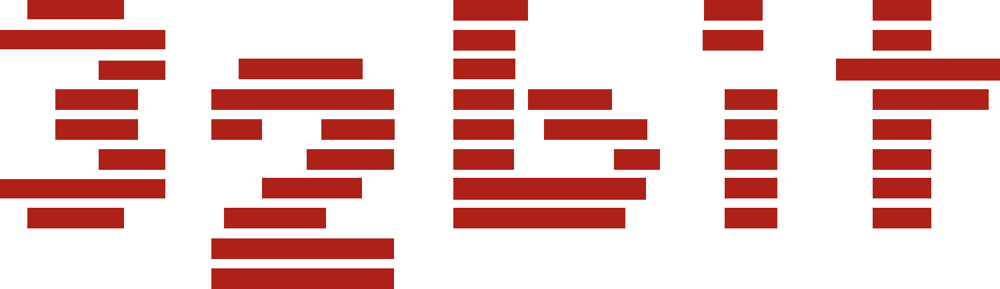
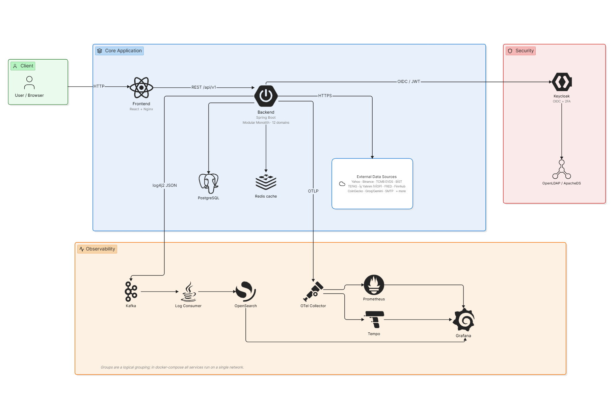

<table border="0" cellspacing="0" cellpadding="0">
<tr>
<td width="200" align="center" valign="middle">

</td>
<td valign="middle">

# Finans Portalı

**Toyota 32Bit · Çok varlıklı portföy takip ve piyasa izleme platformu**

[English](README.en.md) · **Türkçe** &nbsp;·&nbsp; [](LICENSE)

</td>
</tr>
</table>

<p align="center">
  
  
  
  
  
  
  <br/>
  
  
  
  
  
</p>

---

> **Finans Portalı**, Türkiye finans piyasalarına odaklanan, çok varlıklı bir **portföy takip ve piyasa izleme** platformudur. Hisse senedi, kripto para, döviz, yatırım fonu, tahvil/bono, Eurobond, VİOP vadeli işlemleri, emtia, kıymetli metaller, borsa endeksleri, ekonomik göstergeler ve finansal haberleri tek bir arayüzde toplar; üzerine portföy takibi, fiyat alarmları, teknik analiz, yapay zekâ sohbet asistanı ve kişiselleştirilmiş haber akışı ekler.

## Proje Hakkında

Sistem üç ana katmandan oluşur:

- **Backend** — Java 21 + Spring Boot 3.2.1. Modüler monolit + Clean Architecture; 12 işlevsel domain, REST API, çoklu dış veri entegrasyonu ve dayanıklılık desenleri. → [Backend README](backend/finance-portal-backend/README.md)
- **Frontend** — React 19 + Vite tek sayfa uygulaması (SPA). Keycloak OIDC, TR/EN i18n, açık/koyu tema, finansal grafikler ve özelleştirilebilir kontrol paneli. → [Frontend README](frontend/finance-portal-frontend/README.md)
- **Altyapı** — Docker Compose ile tam yığın: kimlik (Keycloak + LDAP), mesajlaşma (Kafka), gözlemlenebilirlik (OpenSearch, Prometheus + Grafana, Tempo + OpenTelemetry). Kubernetes (GKE) manifest'leri ve GitHub Actions CI/CD ile birlikte gelir.

> Teknoloji detayları için [Kullanılan Teknolojiler](#kullanılan-teknolojiler), mimari için [Sistem Mimarisi](#sistem-mimarisi) bölümüne bakınız.

## İçindekiler

- ▸ [Neler Yapabilir?](#neler-yapabilir)
- ▸ [Sistem Mimarisi](#sistem-mimarisi)
- ▸ [Kurulum ve Çalıştırma](#kurulum-ve-çalıştırma)
- ▸ [Kullanılan Teknolojiler](#kullanılan-teknolojiler)
- ▸ [Dizin ve Kod Yapısı](#dizin-ve-kod-yapısı)
- ▸ [Servisler ve Erişim Bilgileri](#servisler-ve-erişim-bilgileri)
- ▸ [Sunucu Tarafı (Backend)](#sunucu-tarafı-backend)
- ▸ [İstemci Tarafı (Frontend)](#istemci-tarafı-frontend)
- ▸ [İzleme ve Gözlemlenebilirlik](#izleme-ve-gözlemlenebilirlik)
- ▸ [Güvenlik Mimarisi](#güvenlik-mimarisi)
- ▸ [Sürekli Entegrasyon ve Dağıtım](#sürekli-entegrasyon-ve-dağıtım)
- ▸ [Test ve Kod Kalitesi](#test-ve-kod-kalitesi)
- ▸ [Dikkat Edilmesi Gerekenler](#dikkat-edilmesi-gerekenler)
- ▸ [Sık Karşılaşılan Sorunlar](#sık-karşılaşılan-sorunlar)
- ▸ [Detaylı Dökümantasyon](#detaylı-dökümantasyon)
- ▸ [İletişim](#i̇letişim)
- ▸ [Lisans](#lisans)

## Neler Yapabilir?

| Alan | Açıklama |
|---|---|
| **Hisse Senedi / Endeks** | BIST hisseleri ve borsa endeksleri — anlık fiyat, geçmiş, mum (OHLC) grafiği; 40'tan fazla endeks listesi/detayı, kıyaslama. |
| **Kripto Para** | Kripto fiyat, mum grafiği, Korku & Hırs (Fear & Greed) endeksi; çoklu kaynak (Binance → Yahoo → CoinGecko) ile kesintisiz veri. |
| **Döviz (FX)** | TCMB ve banka kurları; kur tablosu, döviz çevirici, kıyaslama, geçmiş grafik. |
| **Yatırım Fonları** | TEFAS fonları (~1000+) — tip/şirket/getiri (1a/3a/6a/1y/3y/5y), detay, kıyaslama. |
| **Tahvil / Bono** | TCMB EVDS DİBS (TCMB sınıflandırmasıyla) + Eurobond (HMB ISIN + Business Insider grafik). |
| **VİOP (Vadeli İşlemler)** | İş Yatırım / Akbank kontratları; long/short pozisyon takibi, teminat, vade kapatma (otomatik settlement). |
| **Emtia / Kıymetli Metal** | Altın, gümüş, platin, paladyum, emtia — fiyat, geçmiş, kıyaslama. |
| **Ekonomi / Enflasyon** | TCMB EVDS (TÜFE, faiz, makro) + FRED (ABD CPI); ekonomik takvim, kredi/mevduat hesaplayıcı. |
| **Portföy Takibi** | Çok varlıklı portföy; maliyet ortalaması, güncel değer, kâr/zarar, varlık dağılımı, performans, "ne olurdu?" (what-if), AI analiz, Excel/PDF dışa aktarma. |
| **İzleme Listesi (Watchlist)** | Çoklu takip listesi, yıldızla hızlı ekleme. |
| **Fiyat Alarmları** | Fiyat / değişim / hacim alarmları; uygulama içi bildirim + e-posta (TR/EN). |
| **Haberler** | Çok kaynaklı (RSS + Finnhub) haber akışı, sınıflandırma, kişiselleştirilmiş "Size Özel" haberler. |
| **Yapay Zekâ Sohbet Asistanı** | Çoklu sağlayıcı (Groq/Gemini) + araç çağırma: fiyat, geçmiş, haber, portföy özeti, ekonomi göstergesi, senaryo simülasyonu, alarm oluşturma, izleme listesine ekleme. |
| **Teknik Analiz** | Hareketli ortalama (MA), RSI, MACD, Bollinger; grafik üzerine çizim ve kaydetme. |
| **Bildirimler** | Uygulama içi bildirim merkezi + zil rozeti. |
| **Bülten (Newsletter)** | Günlük / haftalık / aylık portföy + piyasa özeti e-postası. |
| **Destek Talepleri** | Kullanıcı destek talebi oluşturma; yönetici durum yönetimi. |
| **Yönetim (Admin)** | Kullanıcı yönetimi (Keycloak), ban (cascade), Eurobond ISIN / önbellek yönetimi. |
| **Kimlik** | Keycloak OIDC + TOTP 2FA + LDAP federasyonu + e-posta doğrulama. |
| **Cihazlar Arası Senkron** | Kullanıcı tercihleri (kontrol paneli düzeni, tema, dil, grafik çizimleri) sunucuda saklanır, cihazlar arası taşınır. |

## Sistem Mimarisi

Sistem, **modüler monolit** mimarisiyle tasarlanmıştır: tek bir dağıtılabilir backend uygulaması içinde, işlevsel alanlara göre net biçimde ayrılmış 12 domain (her biri Clean Architecture katmanlı). Tüm bileşenler **konteyner** olarak çalışır; geliştirmede **Docker Compose**, üretimde **Kubernetes (GKE)** ile orkestre edilir. Dış erişim tek bir giriş noktası (reverse proxy / Ingress) üzerinden gelir; backend, dış veri kaynaklarına port/adapter soyutlamasıyla bağlanır.

<!-- TODO: assets/architecture.png buraya eklenecek -->
<p align="center">
  
</p>

**Başlıca bileşenler:**

- **Web Ön Yüz (React + Nginx)** — Kullanıcı arayüzü; `/api` isteklerini backend'e yönlendirir, diğer yolları SPA'ya verir.
- **Backend API (Spring Boot)** — İş mantığı, dış veri entegrasyonu, önbellek ve REST API. JWT'yi Keycloak JWKS ile yerel doğrular.
- **Keycloak + LDAP** — Kimlik doğrulama, yetkilendirme, 2FA; LDAP federasyonu.
- **PostgreSQL** — Kullanıcıya ait kalıcı veri (portföy, alarm, bildirim vb.).
- **Redis** — Önbellek ve dağıtık kilit (ShedLock).
- **Kafka** — Asenkron log akış hattı (backend logları ana iş akışını bloke etmeden taşınır).
- **Log Consumer** — Backend'den **bağımsız, ayrı bir Java servisi**: Kafka'daki log konusunu (topic) dinler ve gelen JSON log kayıtlarını OpenSearch'e yazar (indexler). Loglama ve uygulama mantığının ayrıştırılmasını sağlar.
- **OpenSearch** — Logların depolandığı ve arandığı yer (OpenSearch Dashboards ile sorgulanır).
- **OpenTelemetry → Tempo / Prometheus → Grafana** — Dağıtık izleme, metrik ve panolar.

> Ayrıntılı mimari (C4 modeli, bileşen diyagramları, etkileşim senaryoları) için [Teknik Analiz Dökümanına](#detaylı-dökümantasyon) bakınız.

## Kurulum ve Çalıştırma

Bu bölüm, projeyi **hiç bilmeyen birinin** sıfırdan çalıştırabilmesi için gereken **tüm adımları** içerir. Sistem tek komutla (`docker compose up -d`) ayağa kalkar; API anahtarı doldurmaya **gerek yoktur** (anahtarsız da çalışır).

### 1. Gereksinimler

Bilgisayarınızda yalnızca **Docker** (Compose v2 ile) ve **Git** kurulu olmalıdır. **8 GB+ RAM** önerilir (15+ servis aynı anda çalışır).

| İşletim Sistemi | Docker kurulumu |
|---|---|
| **Windows / macOS** | [Docker Desktop](https://www.docker.com/products/docker-desktop/) (Compose v2 dahil gelir) |
| **Linux** | [Docker Engine](https://docs.docker.com/engine/install/) + Compose plugin — veya tek komut: `curl -fsSL https://get.docker.com \| sudo sh` |

> Java, Node.js veya başka bir şey kurmanıza **gerek yoktur** — her şey Docker konteynerleri içinde çalışır. (Sadece Docker'sız yerel geliştirme yapacaksanız JDK 21 + Node.js 20 gerekir.)
>
> **Linux'ta:** Docker komutlarını `sudo` olmadan çalıştırmak için kullanıcınızı docker grubuna ekleyin (`sudo usermod -aG docker $USER`) ve oturumu yenileyin.

### 2. Kurulum (3 Adımda)

```bash
# 1) Depoyu klonla ve dizine gir
git clone https://github.com/BerkanGulyagci/finance-portal.git
cd finance-portal

# 2) Ortam değişkenleri dosyasını örnekten oluştur (ZORUNLU adım — boş bırakabilirsiniz)
cp backend/finance-portal-backend/.env.local.example backend/finance-portal-backend/.env.local

# 3) Tüm sistemi tek komutla ayağa kaldır
docker compose up -d
```

> ⚠️ **2. adım zorunludur.** `.env.local` dosyası olmadan `docker compose up` hata verir. Örnek dosyayı kopyalamanız yeterlidir — içindeki anahtarları **doldurmasanız bile sistem çalışır** (sadece ilgili dış veri kaynakları/AI/e-posta özellikleri pasif kalır, geri kalan her şey çalışır).

İlk açılışta Docker imajları derlenir ve Keycloak / LDAP / OpenSearch başlatılır — bu **birkaç dakika** sürebilir. İlerlemeyi izlemek için:

```bash
docker compose ps                 # servislerin durumu (hepsi "running"/"healthy" olmalı)
docker compose logs -f backend    # backend loglarını izle
```

### 3. Çalıştığını Kontrol Etme

Sistem hazır olduğunda aşağıdakileri tarayıcıda açın:

| Adres | Görmeniz gereken |
|---|---|
| **http://localhost:5173** | Finans Portalı ana sayfası (haberler, piyasa kartları) |
| **http://localhost:8080/swagger-ui.html** | Backend API dokümantasyonu (Swagger) |
| **http://localhost:8080/actuator/health** | `{"status":"UP"}` yanıtı |

Ana sayfa açılıyorsa kurulum başarılıdır. Giriş yapmak için sağ üstten **Kayıt Ol** ile hesap oluşturun (ilk girişte e-posta doğrulama + 2FA kurulumu istenir). Piyasa ve haber sayfaları **giriş yapmadan** da görüntülenebilir.

### 4. Sistemi Durdurma

```bash
docker compose down          # servisleri durdur (veriler korunur)
docker compose down -v       # servisleri durdur + tüm verileri sil (sıfırdan başlamak için)
```

### Ortam Değişkenleri (Opsiyonel — Tam Özellikler İçin)

Sistem anahtarsız çalışır; ancak bazı dış veri kaynaklarını ve özellikleri etkinleştirmek için `.env.local` dosyasına API anahtarı eklenebilir. Anahtarların **çoğu ücretsizdir** ve aşağıdaki adreslerden alınır:

| Değişken | Servis | Amaç | Anahtar nereden alınır? |
|---|---|---|---|
| `EVDS_API_KEY` | TCMB EVDS | Tahvil, enflasyon, mevduat | [evds2.tcmb.gov.tr](https://evds2.tcmb.gov.tr) (ücretsiz, üyelik) |
| `FRED_API_KEY` | FRED | ABD enflasyon (CPI) | [fred.stlouisfed.org/docs/api](https://fred.stlouisfed.org/docs/api/api_key.html) (ücretsiz) |
| `ASSISTANT_API_KEY` | Groq | Yapay zekâ sohbet asistanı | [console.groq.com/keys](https://console.groq.com/keys) (ücretsiz) |
| `GEMINI_API_KEY` | Gemini | Yapay zekâ (yedek) | [aistudio.google.com/apikey](https://aistudio.google.com/apikey) (ücretsiz) |
| `FINNHUB_API_KEY` | Finnhub | Ekonomik takvim / haber | [finnhub.io](https://finnhub.io/register) (ücretsiz) |
| `COINGECKO_API_KEY` | CoinGecko | Kripto (yedek kaynak) | [coingecko.com/api](https://www.coingecko.com/en/api) (anahtarsız da çalışır) |
| `TEFAS_BEARER_TOKEN` | TEFAS | Yatırım fonları | (anonim varsayılan vardır) |
| `KEYCLOAK_ADMIN_CLIENT_SECRET` | Keycloak | Admin kullanıcı yönetimi | Keycloak konsolu → Clients → `finance-portal-admin-service` → Credentials |
| `SMTP_*` | E-posta | Alarm / bülten e-postaları | Gmail App Password (e-posta göndermek için) |

> Tüm değişkenler ve açıklamaları `.env.local.example` içindedir. **Hiçbirini doldurmasanız bile sistem ayağa kalkar** — yalnızca ilgili özellikler pasif olur. Üretimde bu değerler Kubernetes Secret ile yönetilir.

## Kullanılan Teknolojiler

| Katman | Teknolojiler |
|---|---|
| **Backend** | Java 21, Spring Boot 3.2.1 (Web, Security / OAuth2 Resource Server, Data JPA, Data Redis, Kafka, Mail, Cache, Validation, Actuator), Lombok |
| **Veri** | PostgreSQL 17, Redis 7, Flyway (migration), Hibernate / JPA |
| **Dayanıklılık / Görev** | Resilience4j (retry / circuit breaker), ShedLock (dağıtık kilit), Last Known Good (LKG) önbellek |
| **Frontend** | React 19, Vite, React Router 7, Tailwind CSS, Axios; klinecharts, ECharts, Recharts; react-grid-layout; html-to-image, jsPDF, xlsx |
| **Kimlik** | Keycloak 26, LDAP (ApacheDS), JWT / OAuth2 / OIDC, TOTP 2FA |
| **Mesajlaşma** | Apache Kafka |
| **Gözlemlenebilirlik** | OpenTelemetry, Prometheus, Tempo, OpenSearch + Dashboards, Grafana, log4j2 (JSON) |
| **API Dokümantasyonu** | springdoc-openapi (Swagger UI) |
| **Dağıtım** | Docker, Docker Compose, Kubernetes (GKE), GitHub Actions (CI/CD) |
| **Test / Kalite** | JUnit 5, Testcontainers, WireMock, Vitest, React Testing Library, JaCoCo, SonarQube, k6 (yük testi) |

## Dizin ve Kod Yapısı

```
32bit-finance-portal-backend/
├── backend/finance-portal-backend/    # Spring Boot (Java 21) — REST API, scheduler'lar, fetcher'lar
│   └── src/main/java/com/finance/portal/
│       ├── market/        # Piyasa verileri (hisse, kripto, döviz, fon, tahvil, VİOP, emtia, endeks, ekonomi)
│       ├── portfolio/     # Portföy, işlem, izleme listesi, değerleme, what-if, AI analiz
│       ├── alarm/         # Fiyat / değişim / hacim alarmları
│       ├── notification/  # Uygulama içi bildirim + e-posta
│       ├── news/          # Çok kaynaklı haber toplama + kişiselleştirme
│       ├── assistant/     # Yapay zekâ sohbet asistanı (tool-calling)
│       ├── newsletter/    # Bülten aboneliği + dijest
│       ├── support/       # Destek talepleri
│       ├── preferences/   # Kullanıcı tercihleri (cihazlar arası senkron)
│       ├── admin/         # Kullanıcı yönetimi, ban (Keycloak)
│       ├── auth/          # Kimlik doğrulama yardımcıları, kayıt
│       └── common/        # Çapraz kesen: güvenlik, loglama, önbellek, hata, config
│   └── src/main/resources/{application*.yml, db/migration/V1..V17, log4j2-*}
│
├── frontend/finance-portal-frontend/  # React 19 + Vite SPA
│   └── src/{features, app, components, context, api, router, hooks, i18n, lib, utils}
│
├── log-consumer/          # Kafka → OpenSearch log indexer (ayrı Java servisi)
├── docker/                # apacheds, grafana, keycloak, ldap, otel, postgres, prometheus, tempo config
├── k8s/                   # Kubernetes / GKE manifest (00-base, 01-data, 02-app, 03-monitoring) + WIF setup
├── perf-tests/            # k6 yük testleri
├── .github/workflows/     # CI (ci.yml) + CD (cd.yml)
├── docker-compose.yml     # Tam yığın orkestrasyon
├── assets/                # README görselleri (logo, mimari)
└── README.md
```

## Servisler ve Erişim Bilgileri

Yığın başlatıldıktan sonra aşağıdaki adreslerden erişilebilir.

| Servis | URL | Varsayılan Kimlik (geliştirme) |
|---|---|---|
| **Web Arayüzü (Frontend)** | http://localhost:5173 | — |
| **Backend API** | http://localhost:8080 | (JWT) |
| **Swagger UI** | http://localhost:8080/swagger-ui.html | — |
| **Backend Health** | http://localhost:8080/actuator/health | — |
| **Keycloak** | http://localhost:8081 | `admin` / `admin` |
| **Grafana** | http://localhost:3000 | `admin` / `admin` |
| **Prometheus** | http://localhost:9090 | — |
| **OpenSearch Dashboards** | http://localhost:5601 | — |
| **Tempo** | http://localhost:3200 | — |
| **PostgreSQL** | localhost:5433 | (geliştirme kimliği — `.env`'de) |
| **Redis** | localhost:6379 | — |
| **Kafka** | localhost:9092 | — |
| **OpenSearch (REST)** | localhost:9200 | — |
| **LDAP (ApacheDS)** | localhost:10389 | — |
| **SonarQube** (yalnız `sonar` profili) | http://localhost:9000 | `admin` / `admin` |

> ⚠️ Bu kimlikler **yalnızca geliştirme** içindir; üretimde mutlaka değiştirilmeli ve Kubernetes Secret ile yönetilmelidir.

**İlk giriş:** Keycloak'ta self-register açıktır — `http://localhost:5173` adresinden **Kayıt Ol** ile hesap oluşturabilir veya Keycloak admin konsolundan (`http://localhost:8081`) `finance-portal` realm'inde kullanıcı tanımlayabilirsiniz. İlk girişte e-posta doğrulama ve TOTP 2FA kurulumu gerekir.

## Sunucu Tarafı (Backend)

Backend, Spring Boot 3.2.1 (Java 21) üzerine kurulu **modüler monolit**tir. Tüm uç noktalar `/api/v1/**` altındadır.

- **36 REST denetleyici, 124 uç nokta** — 12 işlevsel domain'e dağılmış.
- **Erişim seviyeleri:** Genel (misafir dahil — piyasa, haber), Kimlikli (portföy, alarm, bildirim), Admin (kullanıcı yönetimi).
- **Standart yanıt:** Tüm yanıtlar `ApiResponse<T>` zarfında (success, message, data, timestamp).
- **22 zamanlanmış görev** — alarm değerlendirme (60 sn), piyasa / fon / tahvil önbellek ısıtma, vade kapatma, bülten dijesti (ShedLock ile dağıtık kilitli).
- **Dayanıklılık:** Last Known Good (LKG) deseni + Resilience4j (retry / circuit breaker) + 50+ Redis önbellek ad alanı.

**Başlıca uç nokta grupları:**

| Grup | Base Path | Erişim |
|---|---|---|
| Piyasa (hisse, kripto, döviz, fon, tahvil, VİOP, emtia, endeks, ekonomi) | `/api/v1/market/**`, `/api/v1/commodities`, `/api/v1/gold` | Genel |
| Haberler | `/api/v1/news/**` | Genel |
| Portföy, işlem, izleme, analiz | `/api/v1/portfolios/**` | Kimlikli |
| Alarmlar | `/api/v1/alarms/**` | Kimlikli |
| Bildirimler | `/api/v1/notifications/**` | Kimlikli |
| Kullanıcı bilgisi ve tercihler | `/api/v1/me/**` | Kimlikli |
| Destek talepleri | `/api/v1/support/**` | Kimlikli |
| Bülten | `/api/v1/newsletter/**` | Kimlikli |
| Sohbet asistanı | `/api/v1/assistant/**` | Genel (sınırlı) |
| Yönetim | `/api/v1/admin/**` | Admin |

> Tam uç nokta listesi için çalışan sistemde **Swagger UI** (`/swagger-ui.html`) ve ayrıntılı backend dökümantasyonu için [`backend/finance-portal-backend/README.md`](backend/finance-portal-backend/README.md) dosyasına bakınız.

### Endpoint Kataloğu (Örnekler)

Aşağıda öne çıkan domain'lerin uç noktaları listelenmiştir. Tam liste için Swagger UI (`/swagger-ui.html`).

**Portföy (`/api/v1/portfolios`)** — Kimlik gerekli

| Metot | Yol | Açıklama |
|---|---|---|
| GET | `/` | Kullanıcının portföylerini listele |
| POST | `/` | Yeni portföy oluştur |
| GET | `/{id}` | Portföy detayı (holdings + değerleme) |
| GET | `/{id}/performance` | Performans (zaman serisi) |
| GET | `/{id}/what-if` | "Ne olurdu?" fırsat-maliyet analizi |
| GET | `/{id}/ai-analysis` | Yapay zekâ portföy analizi |
| GET | `/{id}/rebalance` | Yeniden dengeleme önerisi |
| POST | `/{id}/transactions` | İşlem ekle (alım / satım kaydı) |
| DELETE | `/{id}/transactions/{txId}` | İşlem sil |
| GET / POST / DELETE | `/{id}/watchlist[...]` | İzleme listesi yönetimi |

**Alarmlar (`/api/v1/alarms`)** — Kimlik gerekli

| Metot | Yol | Açıklama |
|---|---|---|
| GET | `/` | Alarmları listele |
| POST | `/` | Alarm oluştur (fiyat / değişim / hacim) |
| GET | `/{id}` | Alarm detayı |
| DELETE | `/{id}` | Alarm sil |

**Piyasa — Hisse (`/api/v1/market/stocks`)** — Genel

| Metot | Yol | Açıklama |
|---|---|---|
| GET | `/` | Hisse listesi (sayfalı) |
| GET | `/{symbol}` | Hisse detayı |
| GET | `/{symbol}/chart` | Grafik verisi |
| GET | `/{symbol}/ohlc` | Mum (OHLC) verisi |

> Benzer desen tüm varlık türlerinde (kripto, döviz, fon, tahvil, VİOP, emtia, endeks) tekrarlanır. Tüm yanıtlar `ApiResponse<T>` zarfındadır.

### Zamanlanmış İşler (Schedulers)

Sistem, dış verileri tazelemek ve periyodik işleri yürütmek için **22 zamanlanmış görev** kullanır. Çoklu kopya ortamında 🔒 işaretliler ShedLock ile yalnızca tek kopyada çalışır.

| Görev | Zamanlama | İşlev |
|---|---|---|
| Alarm değerlendirme | 60 saniye | Aktif alarmları güncel fiyatla kontrol et, tetiklenenleri bildir |
| Piyasa hareketleri ısıtma | ~90 saniye | Movers önbelleğini tazele |
| Fon listesi ısıtma | ~8 dakika | TEFAS fon önbelleğini tazele |
| Tahvil / döviz / ekonomi ısıtma | 2–4 saat | EVDS / FRED önbelleklerini tazele |
| TCMB DİBS sınıflandırma | Her gün 06:20 | Tahvil kategorilerini TCMB'den güncelle |
| Eurobond ISIN tazeleme | Ayın 21'i 06:00 | HMB ISIN listesini güncelle |
| Bülten dijesti 🔒 | Her gün 08:00 | Günlük / haftalık / aylık özet e-postası |
| VİOP / tahvil / Eurobond vade kapatma 🔒 | Her gün 00:30–00:35 | Vadesi dolan pozisyonları otomatik kapat |
| Geçici ban süresi dolumu 🔒 | Periyodik | Süresi dolan banları otomatik kaldır |

## İstemci Tarafı (Frontend)

React 19 + Vite tek sayfa uygulaması (SPA). Tüm veri backend'den `/api/v1/*` ile gelir.

- **9 özellik alanı, 47 sayfa** — dashboard, market (10 varlık türü), portfolio, alarms, news, notifications, profile, admin, auth.
- **3 erişim katmanı:** Genel (misafir), Korumalı (kayıtlı kullanıcı), Admin — `ProtectedRoute` / `AdminRoute` ile.
- **Durum yönetimi:** 7 React Context (kimlik, tema, dil, tercihler, izleme listesi, bildirim, onay) — Redux yok.
- **Grafikler:** klinecharts (detay mum + indikatör + çizim), ECharts (kıyaslama), Recharts (analiz / dağılım).
- **Kimlik:** Keycloak OIDC (PKCE / S256), proaktif + tek-uçuşan token yenileme.
- **Tema & dil:** Açık / koyu tema (CSS değişkenleri, FOUC önleme), TR / EN i18n (14 namespace), çoklu para birimi gösterimi.
- **Dışa aktarma:** Excel (xlsx), PDF (jsPDF), grafik görseli (PNG).

> Ayrıntılı frontend dökümantasyonu için [`frontend/finance-portal-frontend/README.md`](frontend/finance-portal-frontend/README.md) dosyasına bakınız.

## İzleme ve Gözlemlenebilirlik

Sistem, üretim ortamında uçtan uca izlenebilirlik için **üç sütun** (metrik, iz, log) toplar ve OpenTelemetry etrafında birleştirir.

| Sütun | Akış | Depo | Görselleştirme |
|---|---|---|---|
| **Metrikler** | Micrometer → OTel Collector / Actuator | Prometheus | Grafana |
| **İzler (Traces)** | OTel Java Agent → OTel Collector | Tempo | Grafana |
| **Loglar** | log4j2 (JSON) → Kafka → Log Consumer | OpenSearch | OpenSearch Dashboards / Grafana |

**Grafana panoları (4 hazır pano)** — Açılışta **otomatik** yüklenir (provisioning), ek bir işlem gerekmez:

- **APM Panosu** — istek hacmi, yanıt süresi, hata oranı, p95 gecikme, JVM/GC, CPU, HikariCP, devre kesici durumu, önbellek isabet oranı.
- **Dış Veri Kaynakları Panosu** — her dış kaynak için istek/hata/gecikme; **sessiz hata (silent failure)** tespiti (PARSE/EMPTY/RATE_LIMITED) ve scrape kaynaklarında **ban riski (403/429)** izleme. Sistemin 20+ dış kaynağa bağımlılığının doğurduğu riski yönetmek için tasarlanmıştır.
- **Loglar Panosu** — seviye / durum / kategori dağılımı, en çok istek alan uç noktalar, hata oranı.
- **Bildirimler & Alarmlar Panosu** — tetiklenen alarmlar, gönderilen / başarısız e-postalar, bülten abonelikleri, bildirimler.

Ek olarak, kritik kullanıcı/yönetici eylemleri **AUDIT logları** (`CentralBusinessLogService`) ve dış servis çağrıları **entegrasyon logları** (`CentralIntegrationLogService`) olarak yapılandırılmış (JSON) biçimde OpenSearch'e akar.

> Trace ↔ log korelasyonu: Grafana'da bir iz (trace) span'inden doğrudan o isteğin OpenSearch loglarına geçilebilir.

> **Not:** Hazır log panoları **Grafana**'dadır (yukarıdaki "Loglar Panosu") ve açılışta otomatik gelir. **OpenSearch Dashboards** (`http://localhost:5601`) ise ham log üzerinde serbest arama/sorgulama (ad-hoc keşif) için kullanılır; ayrıca pano içeri aktarmaya gerek yoktur.

## Güvenlik Mimarisi

- **Kimlik:** Keycloak 26 (realm `finance-portal`) + LDAP (ApacheDS) federasyonu. OAuth2 / OIDC, JWT (RS256).
- **İki adımlı doğrulama:** TOTP tabanlı 2FA (Google Authenticator / FreeOTP) ve e-posta doğrulama.
- **Yetkilendirme (RBAC):** İki rol — `USER` (kişisel kaynaklar) ve `ADMIN` (yönetim). Tüm erişim kuralları merkezi `SecurityConfig`'te; ek olarak **kaynak sahipliği** doğrulanır (kullanıcı yalnızca kendi verisine erişir).
- **Giriş akışı:** Authorization Code + PKCE (S256). Backend, JWT'yi Keycloak JWKS ile **yerel olarak** doğrular (her istekte Keycloak'a gitmeden).
- **Aktarım güvenliği:** Üretimde HTTPS/TLS (GKE ManagedCertificate — otomatik Let's Encrypt).
- **Diğer önlemler:** CORS yapılandırması, girdi doğrulama (Bean Validation), log sanitizasyonu (CRLF / log injection önleme), anonim kullanıcı için rate limiting (X-Forwarded-For güvenli IP), durumsuz oturum (CSRF saldırı yüzeyi yok), sır yönetimi (`.env.local` / Kubernetes Secret, fail-loud).
- **Ban mekanizması:** Yönetici banı, tek eylemle birden çok modülü etkileyen cascade akışı tetikler (Keycloak hesabı devre dışı + alarm / bülten kapatma + bildirim); süreli ban otomatik geri alınır.

> Güvenlik tasarımı, STRIDE tehdit modeli ve OWASP ASVS referans alınarak yapılmıştır. Ayrıntı için [Teknik Analiz Dökümanının](#detaylı-dökümantasyon) Güvenlik bölümüne bakınız.

## Sürekli Entegrasyon ve Dağıtım

Proje, GitHub Actions tabanlı bir CI/CD hattıyla otomatikleştirilmiştir.

| Hat | Tetikleyici | İşlev |
|---|---|---|
| **CI** (`ci.yml`) | `main`'e push + pull request | Backend `mvn verify` (derleme + testler + JaCoCo) ve frontend Vitest. Başarısızsa değişiklik engellenir. |
| **CD** (`cd.yml`) | Manuel (`workflow_dispatch`) | İmaj derleme + Artifact Registry'ye push (git-SHA etiketli), ardından elle onayla GKE'ye dağıtım. |

**Dağıtım yolları:**

| Yol | Komut | Açıklama |
|---|---|---|
| **Docker Compose** (geliştirme) | `docker compose up -d` | Tek makinede tam yığın (15 servis) |
| **Kubernetes (GKE)** | `kubectl apply -k k8s/...` | Katmanlı manifest (00-base → 01-data → 02-app → 03-monitoring); HPA (2–6 kopya), PDB, ManagedCertificate TLS |
| **CI/CD** | GitHub Actions | Her push'ta CI; CD elle tetikle ile GKE'ye |

**Anahtarsız bulut erişimi:** CD hattı, uzun ömürlü servis hesabı anahtarı yerine **Workload Identity Federation (WIF)** kullanır — kısa ömürlü OIDC token ile kimlik doğrulama (sır sızıntısı riski yok).

> Üretim ortamı GKE üzerinde `portiva` namespace'inde çalışır; tüm dış erişim tek Ingress üzerinden TLS ile sağlanır.

## Test ve Kod Kalitesi

Sistem, test piramidine uygun çok seviyeli bir test stratejisiyle doğrulanır. Kod tabanında **5.000'den fazla test** bulunur (yaklaşık 2.700 backend + 2.500 frontend).

| Test Türü | Araç | Kapsam |
|---|---|---|
| **Birim (Unit)** | JUnit 5 (backend), Vitest (frontend) | Tekil sınıf / fonksiyon mantığı |
| **Entegrasyon** | Spring Boot Test + Testcontainers | Gerçek PostgreSQL / Redis ile akışlar |
| **API (Controller)** | Spring MockMvc | REST uç noktası davranışı |
| **Güvenlik** | spring-security-test | Kimlik doğrulama / yetkilendirme |
| **Bileşen (Component)** | React Testing Library + jsdom | Ön yüz bileşenleri |
| **Smoke** | JUnit 5 | Temel yapı taşlarının (POJO/DTO) hızlı doğrulanması |
| **Dış Servis Mock** | WireMock | Dış API'lerin taklidi |
| **Performans / Yük** | k6 | Yük altında yanıt süresi (`perf-tests/`) |

```bash
# Backend testleri + JaCoCo kapsama raporu
cd backend/finance-portal-backend && ./mvnw verify
# Rapor: target/site/jacoco/index.html

# Frontend testleri
cd frontend/finance-portal-frontend && npm run test

# Yük testi (k6 kurulu olmalı, backend ayakta)
k6 run perf-tests/load-test-safe.js
```

**Kod kalitesi:** JaCoCo (kapsama, CI'da rapor) + **SonarQube** (statik analiz / kalite kapısı, `sonar` profili ile self-hosted, elle çalıştırılır).

## Dikkat Edilmesi Gerekenler

- **Portföy takip sistemidir** — gerçek alım-satım emri göndermez; kullanıcının varlık ve işlemlerini kaydedip değerleme / analiz sunar. Yatırım tavsiyesi değildir.
- **Dış kaynak dayanıklılığı** — sistem 20'den fazla dış kaynağa bağımlıdır; bir kaynak çökse bile Last Known Good (LKG) ile son geçerli veri sunulur, sistem düşmez. API anahtarı olmayan kaynaklar anonim / limitli çalışır.
- **`.env.local` zorunlu** — `docker compose up` öncesi `.env.local.example`'dan kopyalanmalıdır (içi boş bırakılabilir). Bu dosya olmadan başlatma hata verir.
- **Portlar** — Keycloak `8081` (backend `8080` ile çakışmasın diye), PostgreSQL host portu `5433`, backend `8080`, frontend `5173`.
- **SonarQube** ayrı bir Compose profili (`sonar`) altındadır; normal `docker compose up` ile başlamaz (`docker compose --profile sonar up -d` gerekir).
- **Sırlar** — gerçek API anahtarları / şifreler `.env.local` (gitignore) içindedir, repoya gönderilmez. Üretimde Kubernetes Secret kullanılır.
- **Üretim profili (`prod`)** kritik sır eksikse başlatmayı durdurur (fail-loud) — sessizce hatalı yapılandırmayla çalışmaz.

## Sık Karşılaşılan Sorunlar

```bash
# Servislerin durumu + loglar
docker compose ps
docker compose logs -f backend

# Backend sağlık kontrolü
curl http://localhost:8080/actuator/health

# PostgreSQL bağlantısını test et
docker compose exec postgres psql -U berkan -d finance_portal -c "SELECT 1;"

# Port çakışması kontrolü (Windows)
netstat -ano | findstr :8080

# Tamamen temiz başlangıç (TÜM verileri siler)
docker compose down -v && docker compose up -d
```

| Belirti | Olası neden / çözüm |
|---|---|
| `docker compose up` hata veriyor | `.env.local` oluşturulmamış → `cp .env.local.example .env.local` (2. kurulum adımı) |
| Tahvil / enflasyon / mevduat boş | `EVDS_API_KEY` eksik → `.env.local`'e ekleyin |
| AI sohbet "kullanılamıyor" diyor | `ASSISTANT_API_KEY` / `GEMINI_API_KEY` eksik → ekleyin |
| E-posta gönderilmiyor | `SMTP_*` değişkenleri eksik / yanlış |
| Backend açılışı yavaş | Spring Boot + OTel agent + Keycloak JWK fetch nedeniyle ilk açılış birkaç dakika sürebilir; healthcheck'in başlangıç toleransı vardır |
| Sayfa açılmıyor / 502 | Backend henüz hazır değil; `docker compose logs -f backend` ile "Started" mesajını bekleyin |

## Detaylı Dökümantasyon

### API Standartları ve Dokümantasyon

- **Sürümleme (Versioning):** Tüm REST uç noktaları `/api/v1/**` öneki ile sürümlenmiştir; ileride geriye dönük uyumluluğu bozmadan `/api/v2/**` eklenebilir.
- **OpenAPI / Swagger:** API, **springdoc-openapi** ile otomatik belgelenir (etkileşimli, çalışan sistemde anında erişilebilir).
- **Javadoc:** Kaynak kod Javadoc yorumlarıyla belgelenmiştir; tek komutla gezilebilir HTML üretilir.

Sistem ayaktayken (yerelde) erişim adresleri:

| Belge | Adres / Komut |
|---|---|
| **Swagger UI** (etkileşimli) | [http://localhost:8080/swagger-ui.html](http://localhost:8080/swagger-ui.html) |
| **OpenAPI 3 şeması** (JSON) | [http://localhost:8080/v3/api-docs](http://localhost:8080/v3/api-docs) |
| **Javadoc** (HTML) | `cd backend/finance-portal-backend && ./mvnw javadoc:javadoc` → `target/site/apidocs/index.html` dosyasını tarayıcıda açın |

### Proje Dökümanları

Bu README genel bir bakış sunar. Ayrıntılı dökümantasyon:

| Döküman | İçerik |
|---|---|
| **[Analiz Dökümanı (SRS)](docs/Finans_Portali_Analiz_Dokumani.pdf)** | İş / kullanıcı gereksinimleri, fonksiyonel (FR) ve fonksiyonel olmayan (NFR) gereksinimler, veri / arayüz gereksinimleri, kabul kriterleri — *ISO/IEC/IEEE 29148, ISO/IEC 25010* |
| **[Teknik Analiz Dökümanı (SDD)](docs/Finans_Portali_Teknik_Analiz_Dokumani.pdf)** | Mimari (C4), backend / frontend / veri / API / güvenlik / dağıtım / gözlemlenebilirlik tasarımı, mimari kararlar (ADR), riskler, doğrulama — *IEEE 1016, ISO/IEC/IEEE 42010, OWASP ASVS* |
| **Backend README** | [`backend/finance-portal-backend/README.md`](backend/finance-portal-backend/README.md) — backend'e özel teknik detaylar |
| **Frontend README** | [`frontend/finance-portal-frontend/README.md`](frontend/finance-portal-frontend/README.md) — frontend'e özel teknik detaylar |
| **Swagger UI** | `http://localhost:8080/swagger-ui.html` — etkileşimli API dokümantasyonu (çalışan sistemde) |

## İletişim

**Geliştirici:** Berkan Gülyağcı
**Kurum:** Toyota 32Bit
**E-posta:** bgulyaci@gmail.com
**GitHub:** [@BerkanGulyagci](https://github.com/BerkanGulyagci)

## Lisans

Bu proje **MIT Lisansı** altında lisanslanmıştır. Ayrıntılar için [LICENSE](LICENSE) dosyasına bakınız.

---

<div align="center">
<sub>Toyota 32Bit · Finans Portalı — © 2026 Berkan Gülyağcı</sub>
</div>
